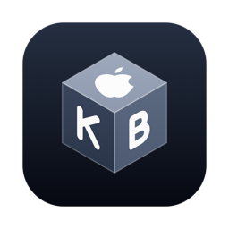
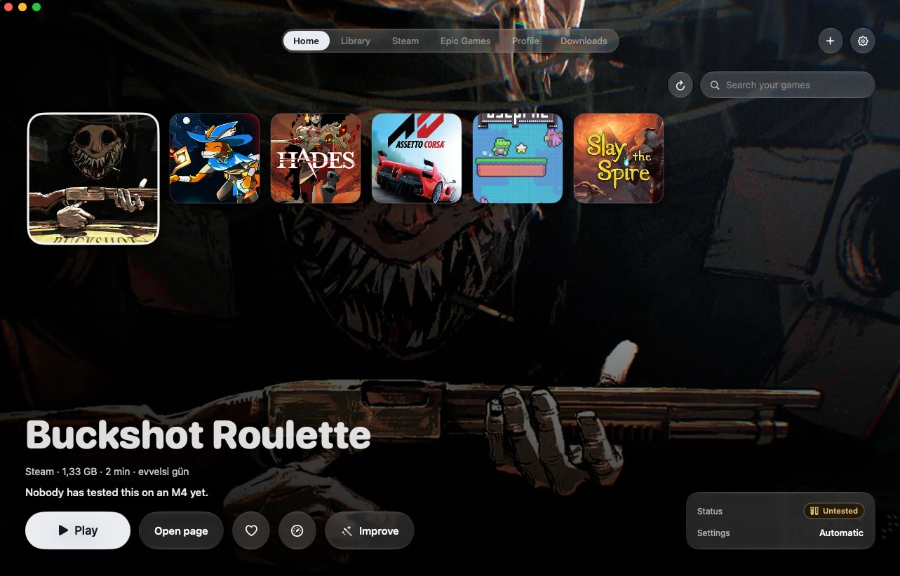
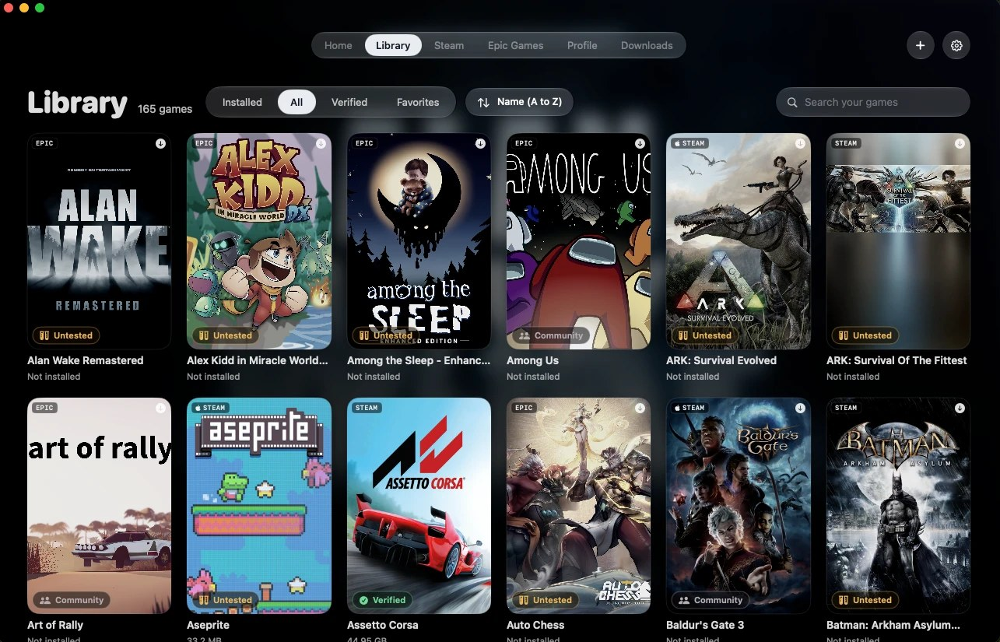
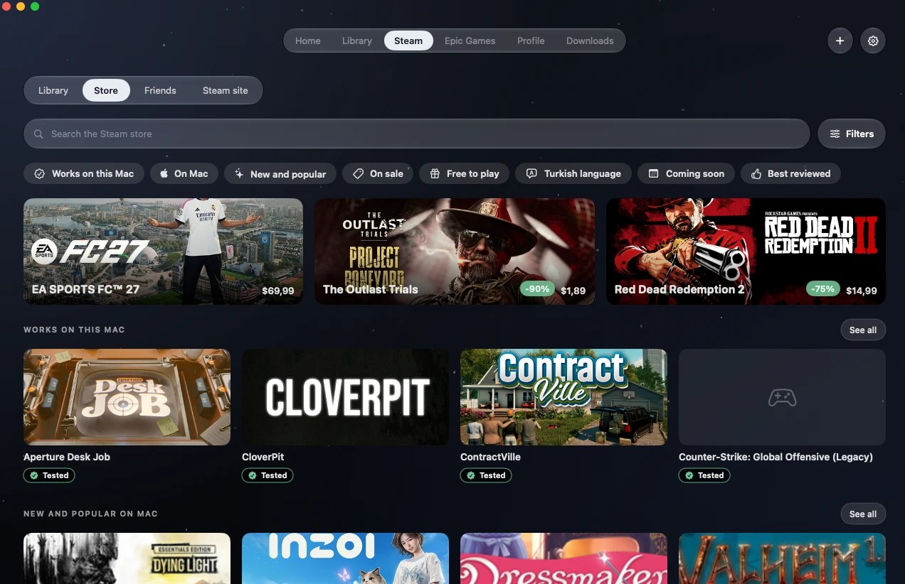
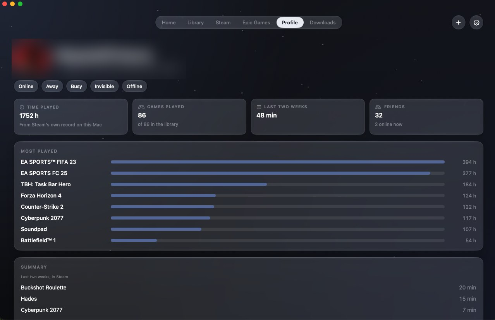
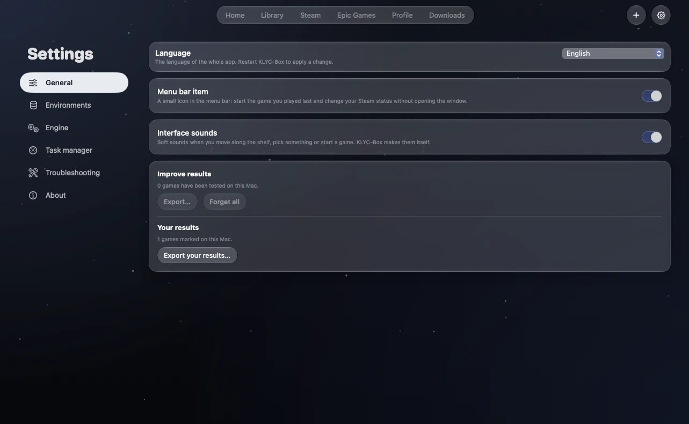
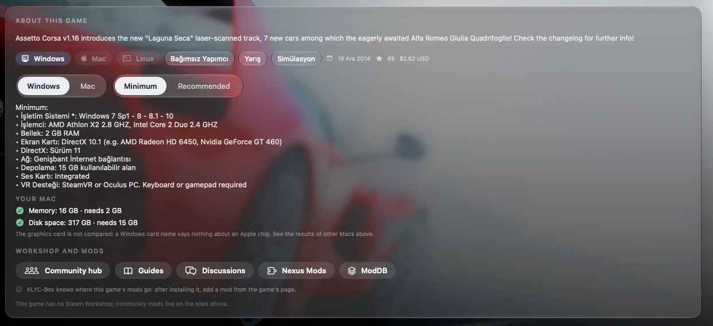
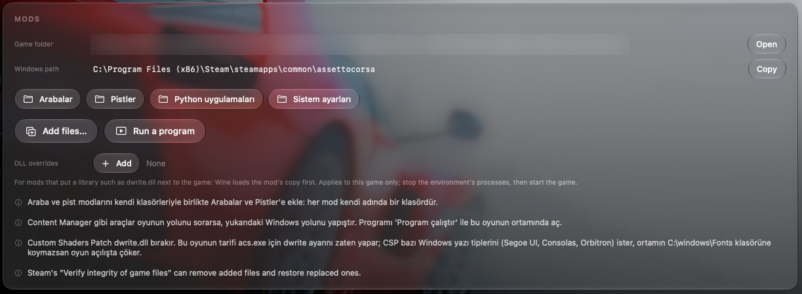

<div align="center">



# KLYC-Box

**Mac'te Windows oyunları ve uygulamaları.**<br>
Steam ve Epic Games kütüphaneni Apple Silicon'da çalıştıran, ücretsiz ve açık kaynaklı bir macOS uygulaması.

<sub>🇬🇧 [Read this in English](README.en.md)</sub>

[](https://github.com/ernklyc/klyc-box/releases/latest)
[](LICENSE)
[](#indirmek)
[](#özellikler)

[**⬇ İndir (.dmg)**](https://github.com/ernklyc/klyc-box/releases/latest/download/KLYC-Box.dmg) &nbsp;·&nbsp; [Oyun rehberi ve site](https://klycbox.ernklyc.dev) &nbsp;·&nbsp; [Sürüm notları](CHANGELOG.md) &nbsp;·&nbsp; [Güvenlik](SECURITY.md)

<br>



</div>

---

## Nedir?
KLYC-Box, Windows oyunlarını ve programlarını Mac'te **Wine, DXMT ve D3DMetal** ile çalıştırır; hepsini Steam ve Epic kütüphanenle birlikte tek bir uygulamada toplar. Kurulum, bir dosyayı sürüklemek kadar kolay.

Bir oyunun Mac'te açılıp açılmayacağını **satın almadan önce** görebilirsin: uygulama, [oyun rehberi sitesinin](https://klycbox.ernklyc.dev) verisini (Atlas) okur. Her oyun için kimin, ne zaman, hangi Mac'te denediği; oyuncu raporları, tahminler ve hile korumasının engellediği oyunlar orada.

> *English: KLYC-Box runs Windows games and apps on Apple Silicon through Wine, DXMT and D3DMetal, with your Steam and Epic libraries in one app. See [README.en.md](README.en.md).*

## İndirmek
1. **[KLYC-Box.dmg](https://github.com/ernklyc/klyc-box/releases/latest/download/KLYC-Box.dmg)** dosyasını indir (SHA-256 özeti ve kaynak kod [sürüm sayfasında](https://github.com/ernklyc/klyc-box/releases)).
2. Dosyayı aç, **KLYC-Box**'ı **Applications** klasörüne sürükle.
3. Uygulamayı Applications'tan aç. Henüz Apple tarafından notarize edilmediği için macOS ilk açılışta uyarı verirse uygulamaya **sağ tıkla › Aç › Aç**. Bunu bir kez yapman yeterli.
4. Steam ve Epic hesaplarına uygulamanın içinden, mağazaların **kendi sayfalarında** giriş yaparsın; KLYC-Box şifreni görmez.

**Gereksinim:** Apple Silicon (M1 ve üstü), macOS 14 veya yenisi.

## Ekran görüntüleri
<table>
<tr>
<td width="50%"><br><sub><b>Kütüphane</b>: Steam ve Epic oyunların bir arada.</sub></td>
<td width="50%"><br><sub><b>Steam mağazası</b> uygulamanın içinde; Mac'te çalışanlar öne çıkar.</sub></td>
</tr>
<tr>
<td width="50%"><br><sub><b>Profil</b>: saatlerin ve arkadaşların, Steam'in kendi kaydından.</sub></td>
<td width="50%"><br><sub><b>Ayarlar</b>: dört dil, tek yer.</sub></td>
</tr>
<tr>
<td width="50%"><br><sub><b>Oyun sayfası</b>: sistem gereksinimleri senin Mac'inle karşılaştırılır.</sub></td>
<td width="50%"><br><sub><b>Modlar</b>: oyun klasörü, Windows yolu ve DLL ayarları.</sub></td>
</tr>
</table>

## Özellikler
- **Dört dil:** Türkçe, English, 简体中文, 日本語 (Ayarlar › Genel › Dil; "Otomatik" Mac'in dilini izler).
- **Atlas:** oyun rehberinin verisi uygulamada. Steam mağazasında **"Bu Mac'te"** süzgeci (denendi, oyuncu bildirdi, tahmin, çalışmaz) ve oyun kartlarında rozetler.
- **Steam ve Epic** bir arada: kütüphane, mağaza, indirmeler (duraklat, devam, iptal), arkadaşlar ve profil.
- **Oyun başına ayar:** grafik modu, kare hızı sınırı, başlatma seçenekleri, modlar, kayıt yedekleri.
- **Siyah ve çelik mavisi tema;** macOS 26 ve üstünde Liquid Glass.
- **Kendi güncelleme kanalı** (Sparkle, kendi imza anahtarı) ve kendi motor deposu; her indirme SHA-256 ile doğrulanır.

## Güvenlik ve gizlilik
- Steam girişi yalnızca Steam'in kendi istemcisinde ve sayfalarında; Epic girişi Epic'in sayfası ve tek kullanımlık kodla. Şifreni ve anahtarlarını KLYC-Box görmez, saklamaz.
- Oyuncu raporları ve çökme raporları **isteğe bağlı**, anonim ve göndermeden önce içeriğini görürsün.
- Ayrıntılar: [SECURITY.md](SECURITY.md) ve sitedeki [gizlilik sayfası](https://klycbox.ernklyc.dev/privacy/).

## Geliştirme
<details>
<summary><b>Derleme, kurulum, bakım ve yayın</b> (geliştiriciler için)</summary>

```sh
swift build && swift test          # geliştirme döngüsü
Scripts/make-app.sh debug          # dist/KLYC-Box.app
Scripts/install-app.sh             # derler, /Applications/KLYC-Box.app olarak kurar ve açar
Scripts/health-check.sh            # git, gizli bilgi, derleme, testler, tarifler, motor yedeği
```
Gereksinimler: Apple Silicon, macOS 14+, Xcode komut satırı araçları. Epic oyunları için `brew install mingw-w64`. Verinin tutulacağı yer `klycbox config home <klasör>` komutuyla seçilir; komut satırı aracı `.build/debug/klycbox`. Mimari: [ARCHITECTURE.md](ARCHITECTURE.md).

**Yayın çıkarmak (bakımcı):**
1. developer.apple.com → Certificates → **Developer ID Application** sertifikası oluştur, Anahtar Zinciri'ne ekle.
2. `xcrun notarytool store-credentials klycbox --apple-id <id> --team-id <takım>` ile notarization profilini kaydet.
3. `KLYC_UPDATES=1 Scripts/release-klyc.sh <sürüm> "özet" notlar.md`: test eder, derler, ilk kurulum testini koşar, DMG, zip ve kaynak arşivini hazırlar, etiketler ve yayınlar. Önce `--dry-run`.

Yayınlanmış sürümler uygulamanın içinden Sparkle ile güncellenir (akış bu depodaki `appcast.xml`). Sürüm geçmişi: [CHANGELOG.md](CHANGELOG.md).
</details>

## Atıflar ve lisans
GPL-3.0 lisanslı, ücretsiz ve açık kaynak. KLYC-Box, Gauthier Piarrette'in [Highball](https://github.com/gauthierpiarrette/highball) projesinin **fork'u** olarak başladı ve onun üzerine geliştiriliyor; emeği için teşekkürler. Wine, Sikarugir, DXMT, DXVK, MoltenVK, Winetricks, Legendary, Sparkle ve diğer tüm projelerin atıfları [NOTICE.md](NOTICE.md) içinde ve uygulamanın **Ayarlar › Hakkında** sayfasında.

> KLYC-Box; Valve (Steam), Epic Games ya da Apple ile bağlantılı değildir ve onlar tarafından onaylanmamıştır. Steam, Epic Games ve Apple adları ilgili sahiplerinin markalarıdır. D3DMetal Apple'a aittir, bu depoda dağıtılmaz; kullanmak için Apple'ın lisansını uygulama içinde kendin kabul edersin. KLYC-Box korsan oyun çalıştırmak ya da hile korumalarını aşmak için değildir. Ücretsizdir ve ticari olmayacaktır: hiçbir özellik için para almaz.
